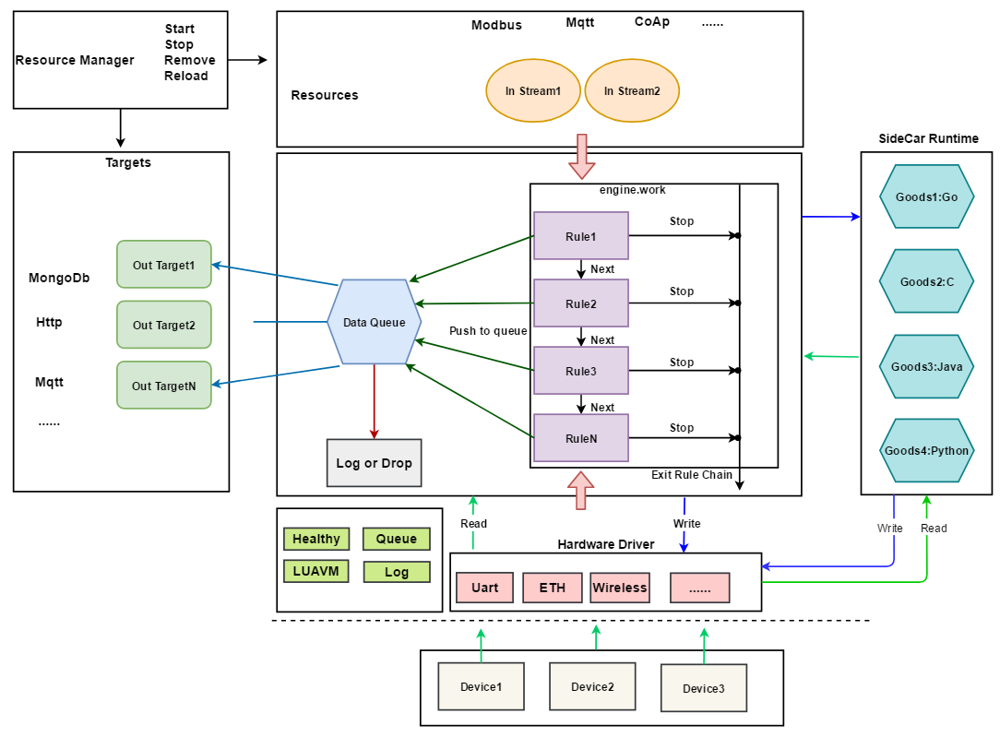

---
nav:
  title: 关于RULEX
  order: 10
group:
  title: 关于RULEX
  order: 10
---

# RULEX 边缘网关开发框架

**_RULEX 是一个由开源社区驱动的轻量级工业类边缘网关开发框架_**

## 项目地址

- <a href="https://github.com/hootrhino/rulex">github</a>
- <a href="https://gitee.com/hootrhino/rulex">gitee</a>

## 架构设计

## 预览

下面是基于 RULEX 框架实现的作品 RhinoGateway 操作界面：

## 贡献者

 

 

 

## Star

