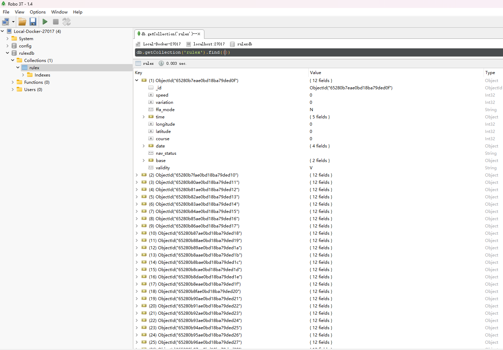

---
nav:
  title: Rule指南
  order: 6

group:
  title: 数据转发与桥接
  order: 6
---

# 持久化 MongoDB

## 文档简介

本文主要解释将数据写入 MongoDB 的方法。

## 函数定义

```lua
data:ToMongo(uuid::string, json::string) -> string
```

## 操作示例

首先新建好 Mongodb 的资源

然后编写脚本：

```lua
Actions = {
    function(data)
        local LuaTable = { name = "rulex", data = "ok"}
        data:ToMongo("uuid", rulexlib:T2J(LuaTable))
        return true, data
    end
}
```

数据展示：

